# Comparative Analysis of Land Use and Crops

**MAgPIE vs. MapBiomas vs. Híbrido (Restore+ / MapBiomas)**
**MAgPIE vs. PAM**

Brazil — 1995, 2000, 2005, 2010 and 2020

*Support for adapting the MAgPIE model to the Brazilian context.*

**Fundo Amazônia Project**
FGV Agro — Getúlio Vargas Foundation
Internal Report — May 2026

## **Executive Summary**

The Fundo Amazônia Project, implemented by FGV Agro, is adapting the MAgPIE (Model of Agricultural Production and its Impact on the Environment) model to adequately represent land-use dynamics in Brazil. As a key step, the MAgPIE seven land-use classes were compared against Brazilian remote sensing–based products, which include MapBiomas (Collection 10) and Restore+ (Version 2), all at 30 m spatial resolution.

In addition, agricultural statistics from the Municipal Agricultural Production Survey (PAM/IBGE) were incorporated to refine and validate the cropland class. PAM provides detailed information on cultivated area for a wide range of temporary and permanent crops, enabling improved representation of crop composition and greater consistency with the Brazilian agricultural context.

The analysis covers five years: 1995, 2000, 2005, 2010, and 2020, considering the seven MAgPIE land-use classes: Primary Forest, Secondary Forest, Cropland, Pasture, Forest Plantation, Urban Area, and Other Land Uses.

A hybrid dataset was built in order to create the most updated high-quality information. This dataset combines the Restore+ products within the Amazon biome and the MapBiomas products elsewhere. However, it was only constructed for all years from 2000 onwards. This means that for 1995, only MapBiomas data are available, and no hybrid configuration was generated due to the absence of Restore+ data for that year. This methodological difference should be considered when interpreting temporal comparisons.

The comparison between MAgPIE outputs and observation-based datasets revealed that the model reproduces the broad spatial organization of Brazilian land-use systems reasonably well, particularly the expansion of agricultural frontiers in the Cerrado and Center-West regions. However, important discrepancies remain in both forest representation and cropland allocation.

The main finding remains a substantial discrepancy in forest partitioning. MAgPIE systematically underestimates primary forest and overestimates secondary forest, while total forest area remains broadly comparable across datasets. This indicates that the issue lies in internal classification rather than total forest extent. These differences have direct implications for carbon accounting, deforestation baselines, and policy-relevant outputs derived from the model, reinforcing the need for improved representation of forest dynamics in MAgPIE for applications in the Brazilian context.

The cropland comparison using PAM agricultural statistics also revealed important differences in crop allocation and spatial representation. The model successfully captures the dominant agricultural regions and the large-scale expansion of commercial agriculture between 1995 and 2020, especially the growth of soybean, maize, sugarcane, and cotton production in the Cerrado and MATOPIBA regions. The results indicate that MAgPIE is able to reproduce the general direction of agricultural frontier expansion and the increasing concentration of commodity-oriented agriculture in central Brazil.

Nevertheless, significant differences were identified between modeled and observed crop distributions. Compared with PAM data, MAgPIE tends to generate smoother and more spatially continuous cropland patterns, whereas observed harvested areas are more spatially fragmented and concentrated in localized production hotspots. This difference is particularly evident for soybean and maize, where the model reproduces regional expansion trends but overgeneralizes the spatial continuity of cultivation areas.

The comparison also suggests that MAgPIE may underestimate the intensity of soybean expansion in key agricultural regions while overestimating some aggregated crop groups classified as “other crops.” In addition, the model shows lower sensitivity to regional production specialization, especially in areas dominated by highly mechanized and export-oriented agricultural systems.

Overall, the results demonstrate that MAgPIE captures the main macro-scale dynamics of Brazilian land-use change, including agricultural expansion and forest conversion processes. However, improvements are still required to better reproduce the spatial heterogeneity of Brazilian agricultural landscapes, crop-specific dynamics, and the distinction between primary and secondary forest classes. The integration of remote sensing products with agricultural statistics proved essential for identifying these limitations and provides a robust framework for future model calibration and validation efforts.

## **Summary**

- **[1. Introduction](#1-introduction)**
- **[2. Data and Methodology](#2-data-and-methodology)**
  - [2.1 Spatial framework and unit of analysis](#21-spatial-framework-and-unit-of-analysis)
  - [2.2 Data sources](#22-data-sources)
  - [2.3 Class harmonization](#23-class-harmonization)
  - [2.4 Aggregation to grid cells](#24-aggregation-to-grid-cells)
  - [2.5 Amazon biome fraction and Hybrid dataset construction](#25-amazon-biome-fraction-and-hybrid-dataset-construction)
  - [2.6 Cropland refinement using agricultural statistics (PAM)](#26-cropland-refinement-using-agricultural-statistics-pam)
  - [2.7 Summary of workflow](#27-summary-of-workflow)
- **[3. Results](#3-results)**
  - [3.1 Comparative overview across years](#31-comparative-overview-across-years)
  - [3.2 Primary forest: persistent and large underestimation](#32-primary-forest-persistent-and-large-underestimation)
  - [3.3 Secondary forest: systematic overestimation](#33-secondary-forest-systematic-overestimation)
  - [3.4 Forest total: consistency despite internal misclassification](#34-forest-total-consistency-despite-internal-misclassification)
  - [3.5 Agriculture: initial deviation and later convergence](#35-agriculture-initial-deviation-and-later-convergence)
  - [3.6 Pasture: consistent overestimation](#36-pasture-consistent-overestimation)
  - [3.7 Forestry, urban areas, and other classes](#37-forestry-urban-areas-and-other-classes)
  - [3.8 Synthesis: a structural partitioning issue](#38-synthesis-a-structural-partitioning-issue)
  - [3.9 Interannual dynamics of agricultural classes](#39-interannual-dynamics-of-agricultural-classes)
  - [3.10 Comparison between PAM and MAgPIE crop allocation](#310-comparison-between-pam-and-magpie-crop-allocation)
  - [3.11 Synthesis of agricultural comparison](#311-synthesis-of-agricultural-comparison)
  - [3.12 Spatial evolution of crop areas in Brazil (1995–2020)](#312-spatial-evolution-of-crop-areas-in-brazil-19952020)
  - [3.13 Comparison with PAM observations](#313-comparison-with-pam-observations)
- **[4. Discussion and Conclusions](#4-discussion-and-conclusions)**
  - [4.1 Structural origin of forest misclassification](#41-structural-origin-of-forest-misclassification)
  - [4.2 Implications for carbon accounting](#42-implications-for-carbon-accounting)
  - [4.3 Implications for policy applications (NDC, REDD+, restoration)](#43-implications-for-policy-applications-ndc-redd-restoration)
  - [4.4 Interpretation of temporal comparisons (1995 vs. 2000–2020)](#44-interpretation-of-temporal-comparisons-1995-vs-20002020)
  - [4.5 Non-forest classes: secondary but relevant biases](#45-non-forest-classes-secondary-but-relevant-biases)
  - [4.6 Implications for model improvement](#46-implications-for-model-improvement)
  - [4.7 Agricultural allocation biases and crop aggregation effects](#47-agricultural-allocation-biases-and-crop-aggregation-effects)
  - [4.8 Implications for land-use transition analyses](#48-implications-for-land-use-transition-analyses)
  - [4.9 Limitations associated with crop harmonization](#49-limitations-associated-with-crop-harmonization)
  - [4.10 Implications for future model calibration](#410-implications-for-future-model-calibration)
- **[Appendix A](#appendix-a)**
- **[Appendix B](#appendix-b)**

## **1. Introduction**

Land-use models play a central role in assessing climate change mitigation, food security, and biodiversity outcomes at global and regional scales. Among them, the MAgPIE (*Model of Agricultural Production and its Impact on the Environment*) model is widely used to simulate long-term land-use dynamics and to generate scenarios that inform international assessments, including those of the IPCC and the *Shared Socioeconomic Pathways* (SSPs).

As a global optimization model, MAgPIE relies on harmonized global datasets for its initialization, particularly the Land-Use Harmonization 2 (LUH2) dataset, which reconstructs land-use history over long temporal horizons. While this ensures internal consistency at the global scale, it may introduce biases when the model is applied at national or subnational levels, especially in countries where high-resolution observational datasets are available.

Brazil represents a particularly relevant case for such evaluation. The country encompasses highly dynamic land-use systems, including the Amazon rainforest, the Cerrado savannas, and major agricultural expansion frontiers. At the same time, Brazil has developed advanced remote sensing products, notably the **MapBiomas** platform, which provides annual land-use and land-cover maps at 30 m resolution from 1985 onwards. In addition, the **Restore+** dataset offers refined classifications for the Amazon biome, with improved discrimination between primary forests, secondary forests, and converted areas.

In addition, agricultural statistics from the Municipal Agricultural Production Survey (PAM) were incorporated to refine cropland estimates and improve consistency with national production data.

Within the Amazon Fund Project, implemented by FGV Agro, MAgPIE is being adapted to better represent land-use dynamics in Brazil. A key step in this process is the systematic comparison between model outputs and observation-based datasets, in order to identify structural inconsistencies and guide model improvements.

This study presents a comparative analysis between MAgPIE and remote sensing–based datasets across five benchmark years: **1995, 2000, 2005, 2010, and 2020**. The analysis considers the seven land-use classes represented in the model—primary forest, secondary forest, cropland, pasture, forestry plantations, urban areas, and other land uses—and evaluates both total area and spatial distribution.

To maximize the use of available data, a hybrid dataset was constructed by combining Restore+ within the Amazon biome and MapBiomas in the rest of the country. This hybrid configuration is available for **2000 onwards**, reflecting the temporal coverage of Restore+. For **1995**, however, only MapBiomas data are available, and no hybrid estimate could be generated. This introduces a methodological discontinuity that must be considered when interpreting temporal comparisons.

The objective of this report is to assess the consistency between MAgPIE and observation-based datasets, with particular attention to systematic biases in land-use allocation, and to provide a robust basis for improving the representation of land-use dynamics in Brazil.

## **2. Data and Methodology**

### **2.1 Spatial framework and unit of analysis**

The analysis is conducted using the MAgPIE spatial grid for Brazil, which consists of 2901 cells at 0.5° resolution (Fig. 1). Each grid cell is treated as the unit of analysis, and its total area is computed using geodesic methods to ensure consistency across latitudes.

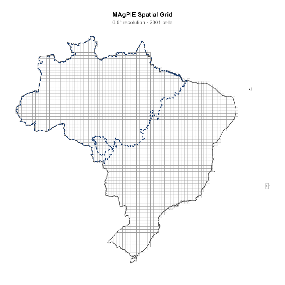

*Figure 1. MAgPIE spatial grid. Distribution of 2901 cells of 0.5º resolution covering Brazil. Dotted line: Amazon limits.*

For each grid cell, land-use information is expressed as area (in Mha) for the seven MAgPIE land-use classes: primary forest, secondary forest, cropland, pasture, forest plantation, urban area, and other land uses.

All spatial datasets were harmonized to a common coordinate reference system and geographically aligned to ensure consistency in spatial operations and comparisons. Following this harmonization, all datasets were aggregated and expressed in terms of land-use area per grid cell.

This grid-based representation provides a consistent spatial framework for integrating multiple data sources with different original resolutions and formats, ensuring full comparability between model outputs and observation-based estimates.

### **2.2 Data sources**

The **MAgPIE** was used as model outputs and initialization data providing land-use allocation per grid cell. As a complement, the following main data sources were used in this analysis:

* **MapBiomas (Collection 10), LUC product**: annual land-use and land-cover maps for Brazil (1985–2023), used for all years analyzed. Classes used: Agriculture, Pasture, Forest Plantation and Urban Area. Available in: https://brasil.mapbiomas.org/downloads/.  
* **MapBiomas (Collection 10), SECVEG product:** specific product for Primary Forest and Secondary Forest, based in suppression and regeneration events detection. Available in: https://brasil.mapbiomas.org/downloads/.  
* **Restore+ (Version 2)**: land-use dataset for the Amazon biome, focused on deforestation, restoration and forest regeneration, available from 2000 onwards, with improved classification of forest types. Here was used to compute all classes inside the Amazonia biome. Available in: https://github.com/restore-plus.  
* **PAM (Municipal Agricultural Production Survey – IBGE)**: municipal-level agricultural statistics were incorporated to refine and validate cropland estimates. PAM provides detailed information on cultivated area and production for a wide range of temporary and permanent crops. Data from Tables 1612 and 1613 were used, enabling a more accurate representation of crop composition and consistency checks against remote sensing–based cropland estimates.

The analysis includes five benchmark years: **1995, 2000, 2005, 2010, and 2020**. For **1995**, only MapBiomas data were used and for the **2000–2020** period, both MapBiomas and Restore+ were used to construct hybrid estimates.

### **2.3 Class harmonization**

The original classes from MapBiomas and Restore+ were reclassified into the seven land-use categories used by MAgPIE (Table 1). This harmonization ensures comparability across datasets, including aggregation of multiple agricultural classes into cropland, consolidation of forest-related classes into primary and secondary forest and assignment of residual classes to the “other” category. 

The harmonization follows a consistent mapping scheme applied to all years and datasets. For the cropland class, this process was complemented by additional disaggregation and validation using PAM agricultural statistics, ensuring consistency between remote sensing data and reported agricultural production (see Section 2.6).

#### **Table 1.** Mapping scheme for harmonized land use classes between different sources.

| MAgPIE  classes | MapBiomas LUC | MapBiomas SECVEG | Restore+ (Amazônia) |
| ----- | ----- | ----- | ----- |
| **Primary Forest** | — | 2: Primary Vegetation | 4: Forest 11: Seasonally Flooded |
| **Secondary Forest** | — | 3: Secondary Vegetation 5: Secondary Vegetation Regeneration | 6: Secondary Vegetation |
| **Agriculture** | 39: Soybean 20: Sugar cane 40: Rice 62: Cotton 41: Other Temporary Crops 46: Coffee 47: Citrus 35: Palm oil  48: Other Perennial Crops | — | 1: Annual Agriculture 2: Semi-Perennial Agriculture |
| **Pasture** | 15: Pasture | — | 10: Pasture |
| **Forest Plantation** | 9: Forest Plantation | — | 5: Silviculture |
| **Urban area** | 24: Urban Area | — | 8: Urban Area |
| **Others** | Residual | — | 3: Water 7: Mining 9: Natural No Forest 12: Annual Deforestation |

*Note: Cropland classes were further refined using PAM data, particularly for crop composition within the aggregated agriculture category.*

### **2.4 Aggregation to grid cells**

For each dataset and year, land-use maps at 30 m resolution were aggregated to the MAgPIE grid. This step produces, for each grid cell and year, a complete land-use allocation comparable to MAgPIE outputs. This process includes the following three steps: 

1. Spatial overlay between raster data and grid cells.  
2. Calculation of the area of each land-use class within each cell.  
3. Conversion of pixel counts to area (Mha) based on spatial resolution.

### **2.5 Amazon biome fraction and Hybrid dataset construction**

To enable integration between datasets, the **fraction of each grid cell overlapping the Amazon biome** was computed. This was done by intersecting the MAgPIE grid with the Amazon biome boundary and calculating the proportion of its area within the biome and the complementary proportion outside the biome for each cell. This variable is a key input for constructing hybrid land-use estimates.

The hybrid dataset was constructed to combine the strengths of the two data sources: **Restore+**, used within the Amazon biome, and **MapBiomas**, used outside the Amazon biome. For each grid cell and land-use class, the hybrid value is computed as:

> *Hybrid = Restore+ × (Amazon fraction) + MapBiomas × (1 − Amazon fraction)*

This approach ensures full consistency with Restore+ in cells entirely inside the Amazon biome, full consistency with MapBiomas outside the biome and smooth transitions in cells that partially overlap the biome. The hybrid dataset was built for the years **2000, 2005, 2010, and 2020**.

For the year **1995**, only MapBiomas data were used, as Restore+ is not available for that period. As a result, no hybrid dataset could be generated for 1995 and comparisons with later years involve a methodological difference. This limitation is explicitly considered in the interpretation of results.

### **2.6 Cropland refinement using agricultural statistics (PAM)**

To improve the representation and internal consistency of cropland estimates, an additional processing step was implemented using data from the Municipal Agricultural Production Survey (PAM), conducted annually by the Brazilian Institute of Geography and Statistics (IBGE).

PAM provides municipal-level information on planted area, harvested area, and production for a wide range of temporary and permanent crops. For this analysis, data from Tables 1612 (temporary crops) and 1613 (permanent crops) were used for the years **1995, 2000, 2005, and 2010**, covering a total of 64 agricultural products.

The integration of PAM data followed three main steps:

**1. Harmonization of crop classes**  
 PAM crop categories were reclassified into the MAgPIE crop system, which operates with a smaller number of aggregated classes. Direct correspondences were established for major crops such as soybean, maize, rice, sugarcane, and cassava. For aggregated MAgPIE classes (e.g., cereals or pulses), PAM crops were grouped based on agronomic and functional similarity. Some MAgPIE classes (e.g., rapeseed, sugar beet, and certain bioenergy crops) have no direct correspondence in PAM and were treated accordingly.

**2. Spatial allocation to the MAgPIE grid**  
 Municipal-level agricultural statistics were spatially allocated to grid cells through the intersection between municipal boundaries and the MAgPIE grid. Crop areas were distributed proportionally based on the area of overlap, ensuring spatial consistency with the grid-based framework.

**3. Consistency checks and cropland adjustment**  
 Aggregated cropland areas derived from MapBiomas were compared with PAM-based estimates. This comparison allowed for validation and, where necessary, adjustment of cropland allocation within grid cells, improving consistency between remote sensing data and agricultural statistics.

The resulting dataset preserves the overall structure of MAgPIE land-use classes while improving the internal representation of cropland. It also introduces greater alignment with the Brazilian agricultural context, particularly in regions with intensive and diversified production.

Limitations remain due to structural differences between datasets. In particular, the “Other crops” category aggregates a wide range of permanent and horticultural products, reducing thematic detail. However, these limitations do not compromise the suitability of the dataset for model applications, provided they are explicitly acknowledged.

A detailed description of crop correspondences between PAM and MAgPIE classes is provided in Appendix B.

### **2.7 Summary of workflow**

The overall processing workflow can be summarized as follows:

1. Definition of the MAgPIE spatial grid and computation of geodesic cell areas  
2. Harmonization of spatial reference systems and geographic alignment of all datasets  
3. Reclassification of MapBiomas and Restore+ classes into the seven MAgPIE land-use categories  
4. Aggregation of high-resolution raster data to the grid-cell level  
5. Calculation of the Amazon biome fraction for each grid cell  
6. Construction of hybrid land-use estimates combining Restore+ and MapBiomas (for 2000 onwards)  
7. Integration of PAM agricultural statistics for cropland refinement and validation  
8. Compilation of harmonized, grid-based land-use datasets for all years analyzed

This workflow ensures consistency across datasets, spatial scales, and time periods, providing a robust and transparent framework for comparing model outputs with observation-based estimates.

## **3. Results**

**Highlights:** 

* **Primary Forest** shows a large systematic gap — Hybrid places it at ~607 Mha (70%) in 1995 declining to ~494 Mha (57%), while MAgPIE only assigns ~204–213 Mha (~24–25%), suggesting the model heavily underestimates primary forest cover.  
* **Secondary Forest** is the inverse — MAgPIE assigns ~303–313 Mha (~36–37%) while Hybrid records under 10 Mha in 1995 growing to just 37 Mha by 2020.  
* **Agriculture** and **Pasture** show MAgPIE overestimating relative to Hybrid in most years.  
* **Forest Plantation** and **Urban Area** are relatively well-aligned between both sources, with modest growth trends.

### **3.1 Comparative overview across years**

Across all five benchmark years (1995, 2000, 2005, 2010, and 2020), the MAgPIE model reproduces the total land budget of Brazil with reasonable fidelity in aggregate, but conceals pronounced internal misallocations between individual cover classes (Fig. 2). The Hybrid observed dataset assigns roughly 87% of the territory to forest (primary and secondary combined) and non-forest natural vegetation ("Others") in 1995, a proportion that diminishes to approximately 80% by 2020 as agriculture and pasture expand. 

*Figure 2. Land use area covered in Mha for the five benchmark years. A) Hybrid data and B) MAgPIE data.*

MAgPIE tracks this broad directional trend — overall forest cover and agricultural pressure move in the same direction in both datasets — yet the magnitudes attributed to each individual class diverge substantially and, in some cases, systematically throughout the entire period (Fig. 3). The most striking discrepancies involve the partition between primary and secondary forest, where the two datasets are nearly mirror images of one another, and the consistent overestimation of pasture relative to observed data. 

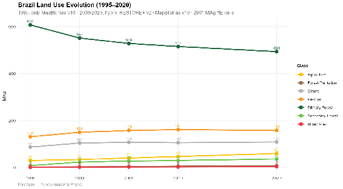

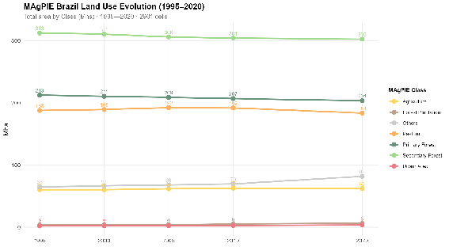

*Figure 3. Land use area covered evolution (Mha) for the five benchmark years. A) Hybrid data and B) MAgPIE data.*

Between 1995 and 2020, observed land cover shows a substantial contraction of primary forest (−113.5 Mha, from 69.6% to 56.6% of the territory) accompanied by the expansion of agriculture (+29.9 Mha), pasture (+26.9 Mha), and secondary forest (+28.1 Mha), reflecting the intensification of land-use change over the 25-year period (Fig. 4A). Urban areas and forest plantations also grew, albeit from a small base, while the "Others" class increased modestly (+21.3 Mha). 

The MAgPIE dataset shows a far more stable land cover configuration between 1995 and 2020, with total forest cover declining by only 18.7 Mha (from 62.2% to 60.0%) and agriculture and pasture remaining nearly unchanged or slightly decreasing — agriculture growing by just 1.6 Mha and pasture actually contracting by 4.1 Mha — suggesting that the model captures long-term structural trends but substantially underestimates the pace and magnitude of land-use change dynamics observed over this period in Brazil (Fig 4B). 

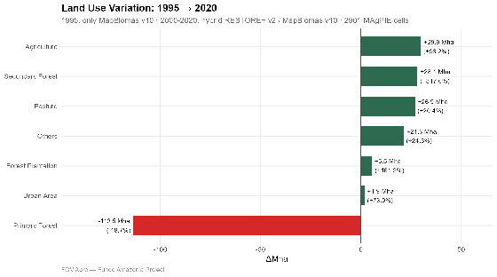  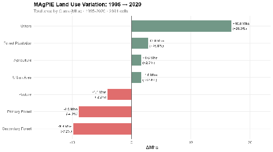

*Figure 4. 25 years land use variation in Mha and percentage between 1995 and 2020. A) Hybrid data and B) MAgPIE data.*

Based on the data, Figure 5 shows:

**1995–2000:** Hybrid records the sharpest five-year deforestation pulse of the entire period, with primary forest losing 55.8 Mha while pasture expands by 18.9 Mha and secondary forest nearly triples from 8.9 to 23.7 Mha — the latter partly reflecting the incorporation of Restore+ data. MAgPIE shows minimal change across all classes, with total forest declining by only 1.9 Mha and agriculture and pasture remaining essentially static.

**2000–2005:** Hybrid continues to record significant primary forest loss (−23.2 Mha), with agriculture expanding by 6.7 Mha and pasture by a further 7.9 Mha, consistent with the peak deforestation years in the Brazilian Amazon. MAgPIE again shows near-stasis, with forest cover declining by just 1.7 Mha and no meaningful change in any individual class.

**2005–2010:** Hybrid reflects the onset of deforestation control policies, with primary forest loss slowing to −12.8 Mha — the smallest five-year decline of the study period — while agriculture continues expanding (+6.5 Mha) and pasture stabilizes (+3.8 Mha). MAgPIE captures a marginal deceleration as well, though forest loss remains negligible (−1.5 Mha) and agricultural change (+1.0 Mha) is far below what Hybrid records.

**2010–2020:** Hybrid shows a renewed acceleration of agricultural and forest plantation expansion (+12.6 Mha and +2.7 Mha respectively) alongside continued but moderated primary forest loss (−21.8 Mha over ten years), while pasture area contracts slightly (−3.6 Mha), suggesting a degree of land-use intensification. MAgPIE over this same decade records a slight decline in pasture (−8.2 Mha) and a marginal increase in agriculture (+0.4 Mha), with forest cover remaining broadly stable — again underestimating the dynamism captured in the observed dataset, though the agricultural totals for 2020 are closely aligned between the two sources.

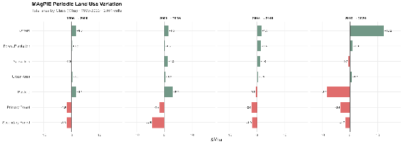

*Figure 5. Land use periodic variation between paired years. A) Hybrid data and B) MAgPIE data.*

In Figure 6, the maps present the spatial distribution of land cover change between 1995 and 2020 for primary forest, secondary forest, and pasture, contrasting observed Hybrid and MAgPIE data on a shared symmetric scale (ΔMha, red = loss, green = gain). In the Hybrid map, primary forest loss is intense and spatially concentrated, forming a well-defined arc of deep red cells across the southern and eastern Amazon — the so-called "deforestation arc" — as well as in parts of the central-west, while secondary forest gains appear diffusely distributed across similar regions, reflecting localized regrowth partially offsetting primary loss; pasture gains are most pronounced in the northeastern Amazon and the Cerrado transition zone, with a notable area of loss in the south of the country. 

The MAgPIE map, by contrast, shows an almost uniformly pale primary forest panel with virtually no detectable spatial signal, confirming that the model captures negligible primary forest dynamics at the pixel level; secondary forest in MAgPIE displays a mixed pattern of modest gains and losses scattered across the center and south of the country — most notably losses in the Cerrado and southern Brazil — while pasture shows a heterogeneous spatial redistribution, with gains in parts of the center-east and losses in the south and southeast, reflecting internal reallocation dynamics rather than the broad frontier expansion visible in the observed data. Together, the two figures reinforce the conclusion that MAgPIE fails to reproduce the spatial intensity and geographic concentration of land-use change that characterizes the observed deforestation process in Brazil over this period. 

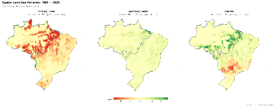  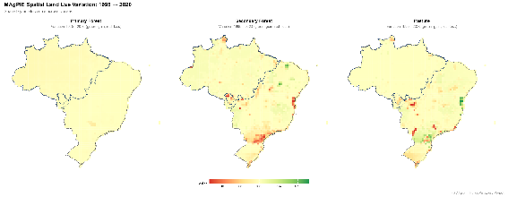

*Figure 6. Spatial visualization of land use variation for the classes Primary Forest, Secondary Forest and Pasture. A) Hybrid data and B) MAgPIE data.*

### **3.2 Primary forest: persistent and large underestimation**

Primary forest is the class with the largest absolute discrepancy between the two datasets. Hybrid records 607.3 Mha in 1995, accounting for nearly 70% of the national territory, declining gradually to 493.8 Mha (56.6%) by 2020, a loss of approximately 113.5 Mha over 25 years (Table 2). MAgPIE, by contrast, assigns only around 212.6 Mha (25.2%) to primary forest in 1995, a figure that remains virtually unchanged throughout the period, reaching 203.7 Mha (24.1%) in 2020. The model thus underestimates primary forest coverage by roughly 395 Mha in 1995 and by 290 Mha in 2020. The gap narrows slightly over time, but only because Hybrid primary forest area declines while the MAgPIE estimate remains quasi-static, not because the model captures any of the observed dynamic. This underestimation is not only large in absolute terms but structurally persistent: the percentage-point difference between Hybrid (69.6%) and MAgPIE (25.2%) in 1995 stands at 44.5 percentage points, and remains at 32.5 percentage points in 2020. 

Figure 7 reveals a stark contrast in both magnitude and spatial dynamics of primary forest cover across the five benchmark years. The Hybrid panel shows a dense, continuous dark-green canopy covering nearly the entire Amazon basin and extending substantially into the Cerrado and Atlantic Forest transitions in 1995 (607.3 Mha), with a visible and progressive lightening of color from 2000 onwards as deforestation erodes forest cover from the southern and eastern Amazon edges — the spatial signature of the deforestation arc — reaching 493.8 Mha by 2020. MAgPIE, by contrast, displays a much more restricted and spatially stable primary forest footprint throughout the entire period: the Amazon core shows moderate green intensity, the areas south of the dashed biome boundary are largely pale or absent, and the total changes minimally from 212.6 Mha in 1995 to 203.7 Mha in 2020 — a decline of less than 9 Mha compared to the 113.5 Mha loss recorded by Hybrid. Beyond the aggregate gap, the spatial pattern differs fundamentally: where Hybrid captures a dynamic frontier with clear directional loss, MAgPIE presents a quasi-static distribution with no discernible spatial progression, confirming that the model not only underestimates primary forest extent by roughly 290–395 Mha depending on the year, but also fails to reproduce the geographic structure of deforestation.

#### **Table 2.**  Primary forest cover in Brazil for selected years (1995–2020): Hybrid and MAgPIE in absolute area (Mha) and share of national territory (%), with difference between datasets.

| Year | Hybrid (Mha) | MAgPIE (Mha) | Diff (Mha) | Hybrid (%) | MAgPIE (%) | Diff (%) |
| :---: | :---: | :---: | :---: | :---: | :---: | :---: |
| 1995 | 607.31 | 212.57 | +394.74 | 69.64% | 25.18% | +44.46% |
| 2000 | 551.55 | 210.80 | +340.75 | 63.25% | 24.97% | +38.28% |
| 2005 | 528.32 | 209.05 | +319.27 | 60.59% | 24.76% | +35.83% |
| 2010 | 515.54 | 207.06 | +308.48 | 59.12% | 24.53% | +34.59% |
| 2020 | 493.78 | 203.67 | +290.11 | 56.62% | 24.13% | +32.49% |

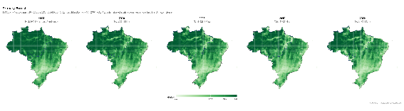

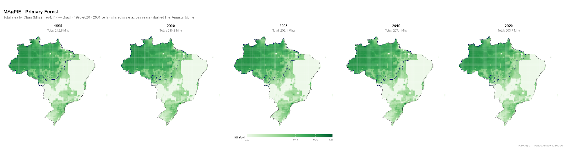

*Figure 7. Primary forest cover in Brazil, 1995–2020: A) Hybrid and B) MAgPIE. Values in Mha per cell; shared scale across years. Dashed line indicates the Amazon biome boundary.*

### **3.3 Secondary forest: systematic overestimation**

The counterpart to the primary forest bias is a strong and consistent overestimation of secondary forest by MAgPIE.

The secondary forest class presents the inverse pattern. Hybrid places secondary forest at a modest 8.9 Mha (1.0%) in 1995, growing progressively to 37.0 Mha (4.2%) by 2020 — a relatively small but ecologically significant expansion of approximately 28 Mha that reflects the partial recovery of degraded lands (Table 3). MAgPIE, however, assigns 312.5 Mha (37.0%) to secondary forest in 1995, declining only marginally to 302.7 Mha (35.9%) in 2020. The model overestimates secondary forest by more than 300 Mha in every benchmark year. This overestimation is the direct counterpart of the primary forest underestimation: the model appears to classify a large portion of what Hybrid identifies as intact primary forest as secondary or regrowth forest, suggesting a systematic definitional or structural misclassification rather than a random error. 

#### **Table 3.** Secondary forest cover in Brazil for selected years (1995–2020): Hybrid and MAgPIE in absolute area (Mha) and share of national territory (%), with difference between datasets.

| Year | Hybrid (Mha) | MAgPIE (Mha) | Diff (Mha) | Hybrid (%) | MAgPIE (%) | Diff (%) |
| :---: | :---: | :---: | :---: | :---: | :---: | :---: |
| 1995 | 8.87 | 312.55 | -303.68 | 1.02% | 37.02% | -36.00% |
| 2000 | 23.74 | 310.70 | -286.96 | 2.72% | 36.80% | -34.08% |
| 2005 | 28.15 | 306.21 | -278.06 | 3.23% | 36.27% | -33.04% |
| 2010 | 30.46 | 304.35 | -273.89 | 3.49% | 36.05% | -32.56% |
| 2020 | 37.01 | 302.68 | -265.67 | 4.24% | 35.85% | -31.61% |

The Figure 8 presents an inverse but equally stark contrast to that observed for primary forest. In Hybrid, secondary forest begins as a sparse and spatially fragmented class in 1995 (8.9 Mha), with light, dispersed green tones concentrated mainly in the eastern Amazon and Cerrado transition zones; cover expands progressively and visibly across all subsequent years, reaching 37.0 Mha by 2020 with increasingly dense clusters along the southern Amazon arc and the northeastern coast — the spatial footprint of forest regrowth on abandoned agricultural and pasture land. MAgPIE, by contrast, opens in 1995 with a dark, near-continuous green canopy covering virtually the entire country (312.5 Mha), including areas that Hybrid classifies as primary forest, and remains essentially unchanged through 2020 (302.7 Mha), showing only a very gradual and spatially diffuse lightening concentrated in the south and Cerrado region. The contrast in both scale and dynamics is thus the mirror image of the primary forest comparison: where Hybrid shows a small, growing, and spatially structured secondary forest class responding to deforestation and abandonment dynamics, MAgPIE presents an overwhelming, static secondary forest cover that occupies much of the territory that remote sensing identifies as intact primary forest — visually confirming the structural mispartitioning between the two forest classes documented in the Results section. 

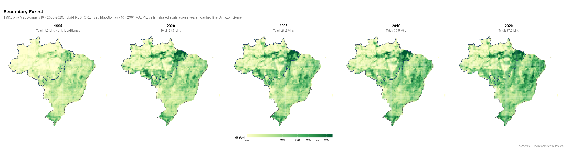

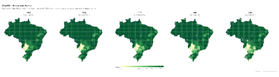

*Figure 8. Secondary forest cover in Brazil, 1995–2020: A) Hybrid and B) MAgPIE. Values in Mha per cell; shared scale across years. Dashed line indicates the Amazon biome boundary.*

### **3.4 Forest total: consistency despite internal misclassification**

When primary and secondary forest are combined into a single total forest class, total forest area in MAgPIE is broadly comparable to observational datasets across all years (Table 4). Hybrid records a combined forest cover of 616.2 Mha (70.7%) in 1995, declining to 530.8 Mha (60.8%) in 2020, a loss of 85.3 Mha. MAgPIE yields a combined total of 525.1 Mha (62.2%) in 1995 and 506.4 Mha (60.0%) in 2020, a reduction of 18.7 Mha. The percentage shares converge from a difference of 8.4 percentage points in 1995 to less than 1 percentage point by 2020. This convergence demonstrates that MAgPIE correctly captures the overall forest cover trajectory at the national scale, and that the primary/secondary discrepancies documented above represent an internal partitioning problem rather than an error in total forested area. From a land systems perspective, the model is broadly consistent with observed data on total forest extent, but misattributes forest type within that total. 

#### **Table 4.** Forest total cover in Brazil for selected years (1995–2020): Hybrid and MAgPIE in absolute area (Mha) and share of national territory (%), with difference between datasets.

| Year | Hybrid (Mha) | MAgPIE (Mha) | Diff (Mha) | Hybrid (%) | MAgPIE (%) | Diff (%) |
| :---: | :---: | :---: | :---: | :---: | :---: | :---: |
| 1995 | 616.18 | 525.12 | +91.06 | 70.66% | 62.20% | +8.46% |
| 2000 | 575.29 | 521.50 | +53.79 | 65.97% | 61.77% | +4.20% |
| 2005 | 556.47 | 515.26 | +41.21 | 63.82% | 61.03% | +2.79% |
| 2010 | 546.00 | 511.41 | +34.59 | 62.61% | 60.58% | +2.03% |
| 2020 | 530.79 | 506.35 | +24.44 | 60.86% | 59.98% | +0.88% |

### **3.5 Agriculture: initial deviation and later convergence**

Agricultural land (cropland) shows a pattern of moderate overestimation in early years that narrows substantially over the period (Table 5). In 1995, Hybrid records 30.4 Mha (3.5%) under agriculture, while MAgPIE allocates 60.6 Mha (7.2%) — a difference of 30.2 Mha, or roughly double the observed extent. Both datasets agree on the direction of change (a consistent expansion of agricultural land throughout the period), but diverge on the pace. By 2020, Hybrid shows 60.3 Mha (6.9%) and MAgPIE 62.2 Mha (7.4%), a difference of only 1.9 Mha — near-perfect alignment. The convergence is driven primarily by Hybrid catching up to the model's earlier estimates as agricultural expansion accelerates in the 2010s. This trajectory suggests that MAgPIE may anticipate or overstate early agricultural expansion but aligns well with observed cropland extent in the most recent period. 

#### **Table 5.**  Agricultural cover in Brazil for selected years (1995–2020): Hybrid and MAgPIE in absolute area (Mha) and share of national territory (%), with difference between datasets.

| Year | Hybrid (Mha) | MAgPIE (Mha) | Diff (Mha) | Hybrid (%) | MAgPIE (%) | Diff (%) |
| :---: | :---: | :---: | :---: | :---: | :---: | :---: |
| 1995 | 30.41 | 60.56 | -30.15 | 3.49% | 7.17% | -3.68% |
| 2000 | 34.43 | 60.54 | -26.11 | 3.95% | 7.17% | -3.22% |
| 2005 | 41.12 | 61.84 | -20.72 | 4.72% | 7.33% | -2.61% |
| 2010 | 47.62 | 62.85 | -15.23 | 5.46% | 7.45% | -1.99% |
| 2020 | 60.27 | 62.20 | -1.93 | 6.91% | 7.37% | -0.46% |

The agriculture panels (Figure 9) reveal a contrasting pattern of spatial concentration versus diffuse distribution. In Hybrid, cropland in 1995 is highly concentrated in the south and southeast of the country — particularly in Rio Grande do Sul, Paraná, and the southern Mato Grosso — with relatively sparse coverage elsewhere (30.4 Mha total); over the following decades, agricultural extent expands northward and westward into the Cerrado and the Mato Grosso agricultural frontier, with color intensity deepening progressively across the center-west by 2020 (60.3 Mha), tracing the well-documented soy and maize expansion into the Brazilian savanna. MAgPIE, by contrast, begins in 1995 with a broadly diffuse orange wash covering much of the center, northeast, and south simultaneously (60.6 Mha) — approximately double the observed extent — with no clear spatial concentration in the major agricultural regions; across subsequent years the total remains nearly static (60.5 to 62.2 Mha), and the spatial pattern changes only marginally, with a slight intensification in the south and a modest lightening in parts of the northeast by 2020. The key distinction is therefore not only quantitative but fundamentally spatial: Hybrid captures a dynamic, frontier-driven expansion with a clear geographic trajectory, while MAgPIE distributes an already-inflated agricultural footprint broadly and uniformly across the territory from the outset, masking the structural transformation of Brazilian agriculture that characterizes the observed period. 

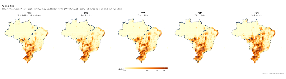

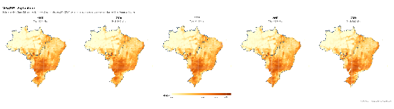

*Figure 9. Agricultural cover in Brazil, 1995–2020: A) Hybrid and B) MAgPIE. Values in Mha per cell; shared scale across years. Dashed line indicates the Amazon biome boundary.*

### **3.6 Pasture: consistent overestimation**

Pasture is the second class where MAgPIE shows a systematic positive bias relative to observed data, though the discrepancy is moderate and relatively stable compared to the forest partitioning issue (Table 6). Hybrid records 131.7 Mha (15.1%) of pasture in 1995, rising to 158.6 Mha (18.2%) in 2020. MAgPIE estimates 187.9 Mha (22.3%) in 1995 and 183.8 Mha (21.8%) in 2020. The model overestimates pasture by roughly 56 Mha in 1995 and 25 Mha in 2020, with a modest convergence over time as Hybrid pasture area expands while MAgPIE pasture area remains roughly stable or slightly declines. The gap in percentage terms narrows from 7.1 to 3.6 points across the period. The consistent overestimation of pasture by MAgPIE may reflect model assumptions about cattle ranching intensities or land suitability that do not fully capture the spatial heterogeneity observed in the Hybrid dataset. 

#### **Table 6.** Pasture cover in Brazil for selected years (1995–2020): Hybrid and MAgPIE in absolute area (Mha) and share of national territory (%), with difference between datasets.

| Year | Hybrid (Mha) | MAgPIE (Mha) | Diff (Mha) | Hybrid (%) | MAgPIE (%) | Diff (%) |
| :---: | :---: | :---: | :---: | :---: | :---: | :---: |
| 1995 | 30.41 | 60.56 | -30.15 | 3.49% | 7.17% | -3.68% |
| 2000 | 34.43 | 60.54 | -26.11 | 3.95% | 7.17% | -3.22% |
| 2005 | 41.12 | 61.84 | -20.72 | 4.72% | 7.33% | -2.61% |
| 2010 | 47.62 | 62.85 | -15.23 | 5.46% | 7.45% | -1.99% |
| 2020 | 60.27 | 62.20 | -1.93 | 6.91% | 7.37% | -0.46% |

The pasture panels (Figure 10) show the closest spatial correspondence of any class compared so far, yet important differences in magnitude, northern extent, and temporal dynamics remain. Both datasets agree on the broad geographic pattern: pasture is predominantly concentrated in the center-west, southeast, and the southern Amazon arc, with the Cerrado and its transitions constituting the core pastoral zone throughout the period. However, Hybrid begins in 1995 with a total of 131.7 Mha and a spatial pattern that is intense in the center-south but leaves large portions of the northern Amazon and northeast relatively pale; it expands progressively and visibly through 2005–2010 (peaking at 162.2 Mha) before slightly contracting by 2020 (158.6 Mha), with the deepening of color in the southern Amazon reflecting frontier cattle ranching expansion. MAgPIE opens at a substantially higher total (187.9 Mha in 1995) with a more uniformly saturated orange tone that extends further north into the Amazon basin and covers the northeast more densely than Hybrid — consistent with the likely misclassification of natural Cerrado and Caatinga vegetation as managed pasture. The model's temporal dynamics are also flatter, rising marginally to 192.5 Mha in 2005 before declining to 183.8 Mha by 2020, without the spatially structured expansion along the Amazon frontier that Hybrid captures. The overestimation is thus not only quantitative but also geographic, with MAgPIE inflating pasture extent in regions where natural non-forest vegetation dominates the observed landscape. 

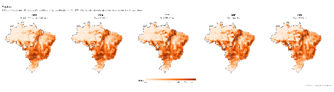

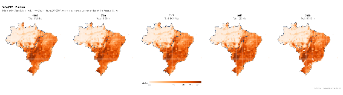

*Figure 10. Pasture cover in Brazil, 1995–2020: A) Hybrid and B) MAgPIE. Values in Mha per cell; shared scale across years. Dashed line indicates the Amazon biome boundary.*

### **3.7 Forestry, urban areas, and other classes**

The remaining classes — forest plantation, urban areas, and "Others" — individually represent smaller fractions of the territory but show distinct patterns worth noting.

Forest plantations are the best-aligned class across the entire comparison (Fig. 11 and Table 7). Hybrid records 3.4 Mha in 1995 expanding to 8.8 Mha (1.0%) by 2020, while MAgPIE shows 3.6 Mha in 1995 rising to 6.4 Mha (0.8%) in 2020. The two datasets agree closely in 1995 (difference of 0.2 Mha) and diverge only modestly by 2020 (2.4 Mha), suggesting that the model captures plantation dynamics with reasonable accuracy, albeit with a slight underestimation of recent plantation expansion.

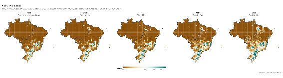

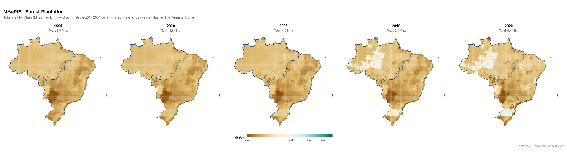

*Figure 11. Forestry cover in Brazil, 1995–2020: A) Hybrid and B) MAgPIE. Values in Mha per cell; shared scale across years. Dashed line indicates the Amazon biome boundary.*

#### **Table 7.** Forestry cover in Brazil for selected years (1995–2020): Hybrid and MAgPIE in absolute area (Mha) and share of national territory (%), with difference between datasets.

| Year | Hybrid (Mha) | MAgPIE (Mha) | Diff (Mha) | Hybrid (%) | MAgPIE (%) | Diff (%) |
| :---: | :---: | :---: | :---: | :---: | :---: | :---: |
| 1995 | 3.38 | 3.64 | -0.26 | 0.39% | 0.43% | -0.04% |
| 2000 | 3.83 | 3.80 | +0.03 | 0.44% | 0.45% | -0.01% |
| 2005 | 4.39 | 3.97 | +0.42 | 0.50% | 0.47% | +0.03% |
| 2010 | 6.14 | 5.39 | +0.75 | 0.70% | 0.64% | +0.06% |
| 2020 | 8.83 | 6.40 | +2.43 | 1.01% | 0.76% | +0.25% |

Urban areas display a consistent but small positive bias in the Hybrid data relative to MAgPIE throughout the period (Fig. 12 and Table 8). Hybrid shows 2.6 Mha (0.29%) in 1995 and 4.4 Mha (0.51%) in 2020, against model estimates of 2.0 Mha (0.23%) and 3.6 Mha (0.43%) respectively. The absolute differences are minor — under 1 Mha at any given year — but the model consistently underestimates urban extent, which likely reflects the coarse spatial resolution at which MAgPIE represents urban or built-up land.

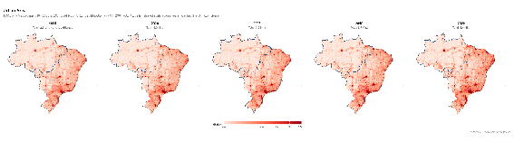

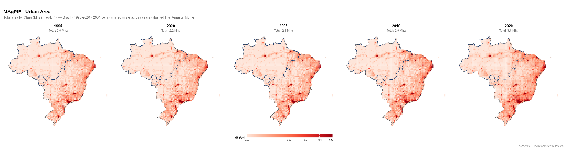

*Figure 12. Urban area cover in Brazil, 1995–2020: A) Hybrid and B) MAgPIE. Values in Mha per cell; shared scale across years. Dashed line indicates the Amazon biome boundary.*

#### **Table 8.** Urban area cover in Brazil for selected years (1995–2020): Hybrid and MAgPIE in absolute area (Mha) and share of national territory (%), with difference between datasets.

| Year | Hybrid (Mha) | MAgPIE (Mha) | Diff (Mha) | Hybrid (%) | MAgPIE (%) | Diff (%) |
| :---: | :---: | :---: | :---: | :---: | :---: | :---: |
| 1995 | 2.55 | 1.97 | +0.58 | 0.29% | 0.23% | +0.06% |
| 2000 | 2.98 | 2.24 | +0.74 | 0.34% | 0.27% | +0.07% |
| 2005 | 3.22 | 2.56 | +0.66 | 0.37% | 0.30% | +0.07% |
| 2010 | 3.50 | 2.94 | +0.56 | 0.40% | 0.35% | +0.05% |
| 2020 | 4.42 | 3.60 | +0.82 | 0.51% | 0.43% | +0.08% |

The "Others" class (which aggregates non-classified natural cover, wetlands, and transitional areas) shows persistent and growing underestimation by MAgPIE (Fig. 13 and Table 9). Hybrid assigns 87.8 Mha (10.1%) to this class in 1995, rising to 109.1 Mha (12.5%) in 2020. MAgPIE estimates only 65.1 Mha (7.7%) in 1995, widening the gap in relative terms to 9.7% by 2020 (81.9 Mha). The "Others" category likely absorbs definitional and classification residuals from the Hybrid composite dataset, making direct comparison with the model particularly sensitive to how each approach handles non-dominant or transitional land cover types.

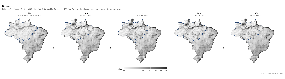

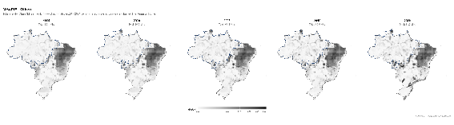

*Figure 13. Class “Others” cover in Brazil, 1995–2020: A) Hybrid and B) MAgPIE. Values in Mha per cell; shared scale across years. Dashed line indicates the Amazon biome boundary.*

#### **Table 9.** Class “Others” cover in Brazil for selected years (1995–2020): Hybrid and MAgPIE in absolute area (Mha) and share of national territory (%), with difference between datasets.

| Year | Hybrid (Mha) | MAgPIE (Mha) | Diff (Mha) | Hybrid (%) | MAgPIE (%) | Diff (%) |
| :---: | :---: | :---: | :---: | :---: | :---: | :---: |
| 1995 | 87.82 | 65.06 | +22.76 | 10.07% | 7.71% | +2.36% |
| 2000 | 104.93 | 66.68 | +38.25 | 12.03% | 7.90% | +4.13% |
| 2005 | 108.38 | 68.14 | +40.24 | 12.43% | 8.07% | +4.36% |
| 2010 | 106.51 | 69.65 | +36.86 | 12.21% | 8.25% | +3.96% |
| 2020 | 109.12 | 81.88 | +27.24 | 12.51% | 9.70% | +2.81% |

### **3.8 Synthesis: a structural partitioning issue**

Taken together, the results reveal that the main discrepancy between MAgPIE and the Hybrid observed dataset is not a generalized failure of the model to represent Brazilian land cover, but rather a structural mispartitioning between primary and secondary forest that propagates across the entire analysis period without attenuation. The model allocates approximately 300 Mha of what Hybrid classifies as primary forest to the secondary forest category, while simultaneously overestimating pasture and early-period cropland relative to observed data. These biases partially offset one another at the aggregate level, yielding reasonable total forest estimates and an accurate directional trajectory for deforestation and agricultural expansion. However, the internal class allocation errors have significant implications for applications that depend on distinguishing primary from secondary forest — including carbon stock estimation, biodiversity assessments, and the valuation of ecosystem services — where MAgPIE's near-equivalence of primary and secondary forest extent would lead to fundamentally different conclusions from those supported by the observed data. 

Across all years analyzed, the results consistently indicate that the main discrepancy between MAgPIE and observational datasets is **not the total amount of land in major categories**, but rather **how that land is internally classified**.

The most critical issue is the misallocation between primary and secondary forests:

* Large and persistent **underestimation of primary forest**  
* Corresponding **overestimation of secondary forest**  
* Relatively accurate **total forest area**

This pattern is already present in 1995 and remains stable through 2020, indicating a structural feature of the model rather than a temporal artifact.

From a modeling perspective, this suggests that improvements should focus on **redefining forest classification criteria and initialization data**, rather than adjusting total land allocation.

### **3.9 Interannual dynamics of agricultural classes**

The PAM-derived agricultural dataset showed major changes in cropland composition between 1995 and 2020 (Fig. 14 and 15). Soybean was the crop with the strongest expansion, increasing from 11.7 Mha (24.3% of total cropland) in 1995 to 37.2 Mha (46.7%) in 2020. Maize also increased over time, from 14.2 Mha (29.4%) to 18.4 Mha (23.1%), although its proportional participation decreased due to soybean expansion.

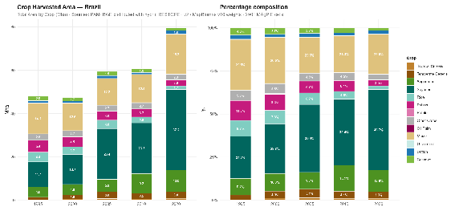

*Figure 14. Crop area covered for the five benchmark years from PAM data. A) Mha and B) percentage.*

Sugarcane expanded from 4.6 Mha (9.5%) in 1995 to approximately 10.0 Mha (12.5%) in 2020, with most of the increase occurring after 2005. Secondary increases were also observed for oil palm and tropical cereals, although both remained relatively small components of total cropland area (Fig. 14).

In contrast, rice decreased from 4.4 Mha (9.1%) in 1995 to 1.7 Mha (2.1%) in 2020 (Fig. 15). Pulses declined from 5.4 Mha (11.2%) to 2.8 Mha (3.5%), while cassava decreased from 2.0 Mha (4.1%) to 1.2 Mha (1.5%). Potato, groundnut, and sunflower remained below 2 Mha throughout the series.

The “Other Crops” category remained relatively stable in absolute area, fluctuating between approximately 2.3 and 2.8 Mha across the analyzed years, although its proportional contribution declined over time.

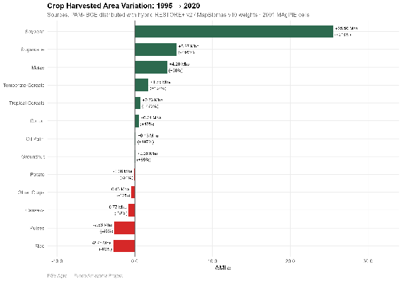

*Figure 15. 25 years crop area variation in Mha and percentage between 1995 and 2020, PAM data.*

### **3.10 Comparison between PAM and MAgPIE crop allocation**

The comparison between PAM-derived agricultural statistics and MAgPIE outputs revealed substantial differences in the allocation of several crop classes (Fig. 16). Soybean area in MAgPIE increased from approximately 17–18 Mha in 1995 to 26–27 Mha in 2020, while PAM estimated a stronger increase from 11.7 Mha to 37.2 Mha over the same period (Fig. 17). As a result, MAgPIE underestimated soybean expansion in the most recent years.

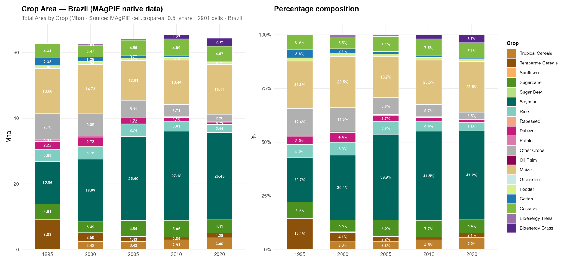

*Figure 16. Crop area covered for the five benchmark years from MAgPIE data. A) Mha and B) percentage.*

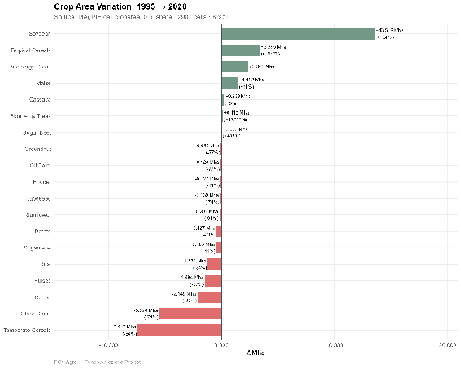

*Figure 17. 25 years crop area variation in Mha and percentage between 1995 and 2020, MAgPIE data*

Maize estimates were comparatively similar between datasets. PAM values ranged from 14.2 to 18.4 Mha, while MAgPIE estimates remained between approximately 12 and 17 Mha depending on the year. Sugarcane also showed relatively similar magnitudes, although MAgPIE tended to underestimate expansion after 2010.

Rice and pulses were consistently underestimated by MAgPIE relative to PAM. Conversely, cassava area was systematically overestimated by the model. One of the largest discrepancies was observed for temperate cereals, for which MAgPIE allocated substantially larger areas than those reported by PAM, especially in 1995 and 2000.

The “Other Crops” category also differed considerably between datasets. PAM estimated relatively stable areas close to 2–3 Mha throughout the series, whereas MAgPIE allocated much larger areas in earlier years followed by progressive reductions over time.

Additional crop categories represented in MAgPIE, including rapeseed, sugar beet, bioenergy grasses, bioenergy trees, and fodder classes, had no direct equivalent in PAM and therefore could not be directly compared.

### **3.11 Synthesis of agricultural comparison**

Overall, both datasets indicate strong agricultural expansion between 1995 and 2020, particularly associated with soybean and sugarcane growth. However, important differences persist in the magnitude and proportional allocation of several crop classes. PAM-derived statistics show a stronger specialization toward commodity crops, especially soybean, while MAgPIE distributes cropland more broadly among aggregated crop groups (Fig. 18 and 19). The largest discrepancies were associated with soybean, cassava, temperate cereals, and the “Other Crops” category. Despite these differences, the general temporal trajectories were broadly consistent between datasets, particularly for the dominant agricultural classes.

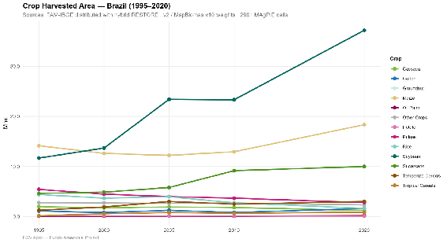

*Figure 18. Crop area covered evolution (Mha) for the five benchmark years, PAM data.*

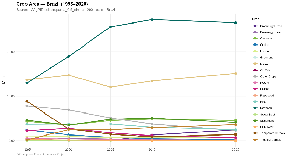

*Figure 19. Crop area covered evolution (Mha) for the five benchmark years, MAgPIE data*

### **3.12 Spatial evolution of crop areas in Brazil (1995–2020)**

The comparison between the 1995 and 2020 crop-area maps generated by the MAGPIE model for Brazil reveals substantial changes in the spatial organization of agricultural production over the 25-year period (Fig. 20 and 21). Overall, the results indicate a strong expansion and intensification of large-scale agriculture toward the Center-West and northern Cerrado regions, accompanied by increasing spatial specialization of several major commodity crops.

The most significant transformation is observed in soybean cultivation. In 1995, soybean production was primarily concentrated in southern Brazil, especially in Paraná, Rio Grande do Sul, and parts of Mato Grosso do Sul. By 2020, soybean cultivation had expanded extensively into Mato Grosso, Goiás, and the MATOPIBA region (Maranhão, Tocantins, Piauí, and Bahia), forming a much broader and more continuous agricultural corridor across the Cerrado biome. This spatial shift reflects the consolidation of export-oriented agribusiness systems and the growing importance of mechanized agriculture in central Brazil.

Maize production also shows a marked spatial expansion between 1995 and 2020. While maize cultivation was initially concentrated in southern and southeastern regions, the 2020 distribution indicates major growth in Mato Grosso, Goiás, and Mato Grosso do Sul. The overlap between soybean and maize areas suggests the increasing adoption of double-cropping systems (soybean–maize succession, or *safrinha*), which became a defining feature of agricultural intensification in the Cerrado frontier.

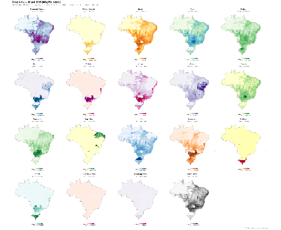

*Figure 20. Crop area in Brazil according to MAgPIE data in 1995. Values in Mha per cell. Dashed line indicates the Amazon biome boundary.*

Sugarcane cultivation expanded significantly during the study period, particularly beyond its traditional core in the state of São Paulo. By 2020, sugarcane production had spread into Goiás, Mato Grosso do Sul, and the Triângulo Mineiro region. This expansion is closely associated with the growth of Brazil’s ethanol and biofuel industries, which stimulated the territorial expansion of energy-oriented agricultural systems.

In contrast, rice cultivation exhibited a relative spatial contraction. In 1995, rice production was more widely distributed across southern, central-western, and some northern regions. By 2020, production became increasingly concentrated in Rio Grande do Sul, while many inland areas showed declining rice cultivation. This pattern likely reflects the replacement of lower-value staple crops by more profitable commodity crops such as soybean and maize.

Cassava maintained a broad distribution throughout both years, particularly in northern and northeastern Brazil, although its relative importance declined compared to export-oriented commodities. The persistence of cassava cultivation in these regions suggests the continued relevance of smallholder and subsistence-oriented agricultural systems.

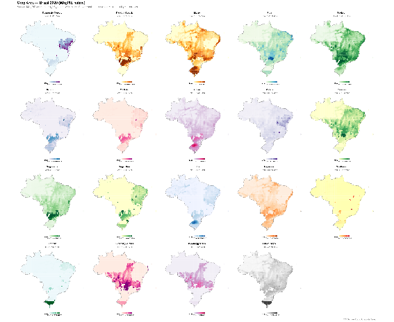

*Figure 21. Crop area in Brazil according to MAgPIE data in 2020. Values in Mha per cell. Dashed line indicates the Amazon biome boundary.*

Cotton production underwent a clear spatial reorganization during the study period. In 1995, cotton cultivation was relatively dispersed, with stronger representation in southern and southeastern Brazil. By 2020, production had become concentrated in Mato Grosso and western Bahia, indicating the incorporation of cotton into highly mechanized agribusiness systems operating in the Cerrado.

Temperate cereals displayed the opposite trend, with a reduction in cultivated area and increasing concentration in southern states such as Paraná and Rio Grande do Sul. This reduction suggests a partial replacement of traditional temperate crops by soybean-based production systems.

### **3.13 Comparison with PAM observations**

A comparison between the MAgPIE 2020 maps and the observed harvested-area maps derived from the PAM dataset reveals both important consistencies and notable differences in spatial representation (Fig. 22 and 23). In general, both datasets identify the same major agricultural regions and reproduce the dominance of soybean, maize, sugarcane, and cotton in central and southern Brazil. The broad geographical patterns are therefore consistent, indicating that the MAGPIE model captures the main structure of Brazil’s contemporary agricultural frontier.

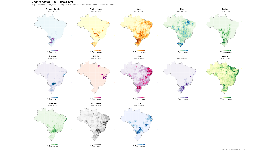

*Figure 22. Crop area in Brazil according to PAM data in 1995. Values in Mha per cell. Dashed line indicates the Amazon biome boundary.*

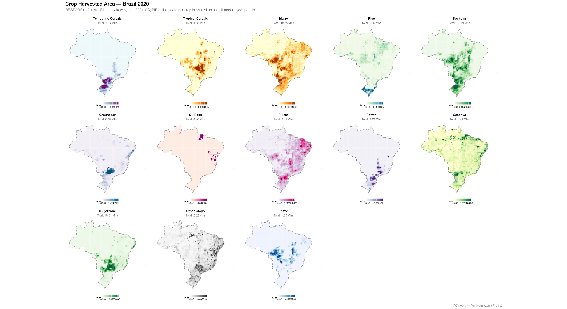

*Figure 23. Crop area in Brazil according to PAM data in 2020. Values in Mha per cell. Dashed line indicates the Amazon biome boundary.*

However, the MAGPIE outputs exhibit a substantially smoother and more spatially continuous distribution of crop areas than the PAM observations. In the PAM-based maps, agricultural production appears more spatially fragmented and concentrated in localized hotspots, reflecting municipality-level variability and the heterogeneity of real agricultural landscapes. By contrast, the MAGPIE simulations distribute crop areas more homogeneously across suitable grid cells, producing diffuse cultivation patterns over extensive regions of the Cerrado.

These differences are particularly evident for soybean and maize. In the PAM dataset, production is concentrated in clearly defined agricultural clusters, especially in Mato Grosso, Goiás, western Bahia, and southern Brazil. In the MAGPIE maps, these same regions are represented, but cultivation spreads more continuously across neighboring cells, suggesting that the model prioritizes regional suitability and aggregated land allocation rather than reproducing local production intensity patterns.

The contrast is also visible in sugarcane and cotton. PAM observations show highly concentrated production nuclei associated with specific agroindustrial regions, whereas MAGPIE generates broader spatial distributions with lower local intensity. Similarly, cassava production in PAM appears highly dispersed and patchy across northern and northeastern Brazil, while the modeled distribution is smoother and more generalized.

Another important distinction concerns the interpretation of the mapped variables. The MAGPIE figures represent simulated crop area shares allocated across model grid cells, whereas the PAM maps correspond to observed harvested area statistics. Consequently, the MAGPIE outputs reflect modeled land-use allocation processes and optimization assumptions, while PAM captures empirical agricultural production patterns recorded at the municipal scale. This methodological difference partly explains the smoother spatial gradients and lower fragmentation observed in the model results.

Overall, the comparison suggests that MAGPIE successfully reproduces the large-scale spatial organization and expansion trends of Brazilian agriculture, especially the consolidation of the Cerrado as the dominant agricultural frontier. Nevertheless, the model tends to underestimate local heterogeneity and overgeneralize the spatial continuity of agricultural landscapes when compared with observed PAM data.

## **4. Discussion and Conclusions**

### **4.1 Structural origin of forest misclassification**

The results consistently show a misallocation between primary and secondary forests, while total forest area remains broadly consistent across datasets. This pattern points to a structural difference in how forest classes are defined and initialized in MAgPIE.

The LUH2 dataset, used to initialize the model, reconstructs land-use transitions over centuries. In this framework, any previously disturbed forest that has regrown is classified as secondary, regardless of its current structure or age. The consequences are visible in the data: MAgPIE assigns approximately 312.5 Mha to secondary forest in 1995 — 37.0% of the national territory — a figure that remains virtually unchanged through 2020 (302.7 Mha, 35.9%), reflecting the quasi-static nature of this historically-derived classification rather than any dynamic response to observed land-use change.

In contrast, MapBiomas and Restore+ rely on Landsat time series (~1985 onwards). Forest areas without detected disturbance during this observational window are classified as primary. As a result, large areas of mature forest — particularly in the Amazon — are classified as primary in remote sensing products but as secondary in LUH2-based datasets. The Hybrid data reflect this: 607.3 Mha (69.6%) classified as primary forest in 1995, declining to 493.8 Mha (56.6%) by 2020 through observed deforestation dynamics, with secondary forest remaining a comparatively minor category throughout (8.9 to 37.0 Mha over the same period).

This fundamental difference in temporal reference frames explains the systematic shift observed in the Results: a persistent misallocation of approximately 300 Mha from primary to secondary forest that neither diminishes nor reverses across the entire study period.

### **4.2 Implications for carbon accounting**

The misclassification between primary and secondary forests has direct consequences for carbon estimates. Primary forests typically store significantly more carbon than secondary forests due to their structural complexity and age. By allocating large areas of primary forest to the secondary category, MAgPIE effectively assigns lower carbon densities to these areas across the entire period.

The scale of this misallocation — approximately 395 Mha in 1995 and 290 Mha in 2020 — is large enough to generate substantial downward biases in total forest carbon stock estimates at the national level. The fact that the gap narrows over time (from 44.5 to 32.5 percentage points) offers limited reassurance, since this narrowing is driven by actual deforestation in the Hybrid data rather than by improved model classification. As a result, total forest carbon stocks are likely underestimated throughout the study period, with compounding implications for emissions baselines, deforestation impact assessments, and the mitigation scenarios derived from the model.

### **4.3 Implications for policy applications (NDC, REDD+, restoration)**

These discrepancies propagate into policy-relevant outputs across multiple frameworks.

**NDC accounting:** The underestimation of primary forest extent and the corresponding misattribution of carbon density to secondary forest categories affect the construction of emissions baselines and the calculation of mitigation potential. If primary forest carbon stocks are systematically underestimated — as suggested by the ~300 Mha misclassification — reported emissions reductions from avoided deforestation may be similarly biased.

**REDD+:** Carbon credit calculations linked to forest protection depend on accurate reference levels for primary forest cover and associated carbon stocks. Overestimation of secondary forest at the expense of primary forest in MAgPIE-based projections could lead to systematically lower carbon credit valuations, affecting the economic viability of REDD+ mechanisms applied in the Brazilian context.

**Restoration policies (e.g., Planaveg):** The model's overestimation of secondary forest extent — 302–312 Mha versus the 9–37 Mha observed in Hybrid — generates inflated assumptions about the current state of natural regeneration. This could lead to an underestimation of actual restoration needs, since the model implicitly treats large areas as already undergoing recovery that the observed data characterize as intact primary forest or, conversely, as degraded land without documented regrowth.

Additionally, the consistent overestimation of pasture extent (by approximately 56 Mha in 1995 narrowing to 25 Mha in 2020) and the early overestimation of agricultural land (30 Mha excess in 1995, converging to near-zero by 2020) may affect projections of land-use change trajectories and the policy scenarios designed to govern them.

### **4.4 Interpretation of temporal comparisons (1995 vs. 2000–2020)**

The inclusion of 1995 introduces an important methodological consideration. Unlike later years, 1995 results rely exclusively on MapBiomas, as Restore+ data are not available for that period. Consequently, comparisons between 1995 and subsequent years combine real land-use changes and differences arising from data sources and classification schemes.

This caveat is particularly relevant for secondary forest, where the Hybrid estimate grows from 8.9 Mha in 1995 to 23.7 Mha in 2000 — an increase of 14.8 Mha in five years that partly reflects the incorporation of Restore+ regeneration data rather than exclusively genuine forest recovery. Similarly, the "Others" class expands from 87.8 Mha in 1995 to 104.9 Mha in 2000, a jump that likely captures reclassification effects alongside actual land-use dynamics. While the main structural patterns — notably the forest partitioning bias of over 300 Mha — are already clearly visible in 1995 and therefore cannot be attributed to data source transitions, quantitative comparisons of rates of change across the full 1995–2020 period should be interpreted with caution, particularly for classes where Restore+ data introduce a discontinuity between the first and subsequent benchmark years.

### **4.5 Non-forest classes: secondary but relevant biases**

Although less pronounced than forest discrepancies, consistent biases are observed in other classes that warrant attention for regional applications of the model.

**Pasture** shows systematic overestimation throughout the period: MAgPIE allocates 187.9 Mha (22.3%) in 1995 and 183.8 Mha (21.8%) in 2020, against Hybrid estimates of 131.7 Mha (15.1%) and 158.6 Mha (18.2%) respectively. The direction of the bias is stable — the model consistently overstates pasture extent — but the magnitude shrinks from 56.2 to 25.2 Mha as observed pasture expansion gradually approaches model levels. This overestimation is most likely attributable to the conflation of natural non-forest vegetation (particularly Cerrado formations) with managed pasture in LUH2-based land categories, a well-documented issue in land-use models applied to the Brazilian savanna biome.

**Agriculture** exhibits a pattern of early overestimation followed by near-complete convergence: MAgPIE assigns twice the observed cropland extent in 1995 (60.6 vs. 30.4 Mha) but aligns closely with Hybrid by 2020 (62.2 vs. 60.3 Mha, a difference of only 1.9 Mha). This convergence is encouraging for applications focused on recent decades, but suggests that the model's historical initialization of agricultural land may not reflect observed expansion pathways accurately, which could affect scenario projections that use the 1995–2000 period as a reference baseline.

**Forest plantations** show the best overall agreement of any class, with differences below 0.3 Mha in 1995 growing to 2.4 Mha by 2020 as Hybrid captures an acceleration of plantation establishment not fully reproduced by MAgPIE. **Urban areas** display a consistent but minor underestimation by the model (below 1 Mha at all time steps), consistent with the known limitation of global land-use models in representing fine-grained urban expansion. These patterns collectively suggest that, beyond forest classification, targeted regional calibration — particularly for the Cerrado biome, where pasture and natural vegetation boundaries are most ambiguous — would be necessary to improve model performance at the national scale.

### **4.6 Implications for model improvement**

The results indicate that improving MAgPIE performance in Brazil requires targeted, structurally motivated adjustments rather than global scaling corrections. The primary source of error — the misallocation of approximately 300 Mha between primary and secondary forest — originates in the initialization dataset and the temporal reference frame used to define disturbance history, not in the model's representation of land-use dynamics per se. This distinction is important: correcting the forest partitioning bias would require revising forest classification criteria in initialization datasets and incorporating shorter disturbance detection windows consistent with the observational period of remote sensing products (~1985 onwards), rather than adjusting dynamic model parameters.

Beyond initialization, the pasture overestimation in natural vegetation-rich biomes such as the Cerrado points to the need for biome-specific land category definitions that distinguish managed grasslands from natural non-forest formations. Similarly, the early agricultural overestimation suggests that historical cropland reconstruction — particularly for the 1990s — could benefit from integration with sub-national agricultural census data to better constrain regional expansion trajectories.

Taken together, these adjustments — revised forest initialization criteria, shorter disturbance windows, and biome-specific category calibration — would likely yield substantial improvements in both land-use representation and the carbon accounting, policy scenario, and restoration assessments derived from the model. Given that the total forest area comparison converges to less than 1 percentage point by 2020, the structural gains from addressing the primary/secondary partitioning issue alone would be sufficient to bring model outputs into close alignment with observed data across the most policy-relevant land cover dimensions.

### **4.7 Agricultural allocation biases and crop aggregation effects**

The comparison between PAM-derived agricultural statistics and MAgPIE outputs indicates that part of the discrepancy originates from differences in thematic aggregation and model structure. PAM represents the Brazilian agricultural system with high thematic detail and direct correspondence to observed production systems, while MAgPIE operates with aggregated crop categories designed for global-scale simulations.

This structural difference becomes particularly evident for classes such as temperate cereals, cassava, and “Other Crops.” In MAgPIE, aggregated crop groups combine products with distinct ecological, economic, and spatial characteristics, which may lead to broader distributions than those observed in national statistics. Conversely, PAM reflects the actual composition of Brazilian agriculture with greater specificity.

The strongest divergence was observed for soybean expansion after 2010. Although MAgPIE reproduces the general increasing trend, the model underestimates the magnitude of recent expansion relative to PAM. This suggests that the allocation mechanisms or calibration parameters used in the Brazilian adaptation may not fully capture the acceleration of commodity-driven agricultural expansion observed in recent decades.

### **4.8 Implications for land-use transition analyses**

Differences in crop allocation directly affect the interpretation of land-use transitions and agricultural intensification processes. Since soybean and sugarcane are major drivers of land conversion in Brazil, underestimating their expansion may alter estimates of cropland dynamics, indirect land-use change, and associated carbon emissions.

Similarly, the overestimation of secondary or aggregated crop groups may dilute the spatial concentration of dominant commodities, producing smoother transitions than those observed empirically. These effects are particularly relevant in frontier regions where rapid agricultural expansion interacts with forest conversion and pasture dynamics.

The integration of PAM statistics therefore provides an important empirical benchmark for evaluating whether modeled cropland transitions reproduce the observed agricultural trajectory of Brazil.

### **4.9 Limitations associated with crop harmonization**

Part of the observed discrepancy derives from unavoidable conceptual differences between PAM and MAgPIE. Several MAgPIE crop categories, including rapeseed, sugar beet, and bioenergy classes, do not have direct equivalents in PAM. Conversely, PAM contains numerous permanent and horticultural crops that must be aggregated into broader categories for compatibility with the model framework.

The “Other Crops” class concentrates much of this heterogeneity. Although operationally necessary, this aggregation reduces thematic detail and limits direct interpretation of specific crop transitions. Therefore, comparisons involving this class should be interpreted cautiously.

In addition, PAM represents harvested or cultivated agricultural area reported at municipal scale, whereas MAgPIE simulates land allocation according to economic and biophysical optimization processes. Consequently, differences are expected not only from classification structure but also from the conceptual nature of each dataset.

### **4.10 Implications for future model calibration**

The PAM comparison highlights several opportunities for improving the Brazilian adaptation of MAgPIE. In particular, the underestimation of soybean expansion and the overestimation of certain aggregated crop groups suggest that crop-specific calibration parameters may require adjustment.

Future improvements could include stronger integration of national agricultural statistics during model initialization and validation stages, refinement of crop aggregation schemes, and incorporation of region-specific expansion dynamics for dominant commodities.

The use of observation-based agricultural datasets also allows the identification of temporal inconsistencies that may not be detectable through aggregated land-use totals alone. Therefore, combining remote sensing products with agricultural statistics provides a more comprehensive framework for evaluating land-use model performance in Brazil.

In addition, the comparison between MAgPIE outputs and PAM observations indicates that the model tends to produce smoother and more spatially continuous agricultural distributions than those observed empirically. While the model successfully captures the large-scale expansion of agriculture into the Cerrado and MATOPIBA regions, it does not fully reproduce the spatial fragmentation and localized production clusters visible in municipal-scale observations. This suggests that future calibration efforts should pay greater attention not only to total crop area allocation, but also to the spatial structure and intensity of agricultural occupation.

One important limitation identified in the comparison is the representation of heterogeneous agricultural systems within aggregated crop classes. In several cases, the modeled distributions of “other crops” or secondary crop groups differ substantially from observed harvested-area patterns, indicating that broad aggregation schemes may obscure regionally important production dynamics. Increasing crop-specific detail, particularly for rapidly expanding commodities such as soybean, maize, cotton, and sugarcane, could improve the spatial realism of simulations.

The results also emphasize the importance of incorporating regional drivers of agricultural expansion into calibration procedures. Infrastructure availability, logistics corridors, land accessibility, technological adoption, and agroindustrial specialization strongly influence the observed concentration of production in specific regions of Brazil. Including these regional constraints and incentives more explicitly in land-allocation routines may improve the model’s ability to reproduce observed agricultural hotspots.

Furthermore, the comparison demonstrates the value of multi-source validation strategies. While remote sensing products provide consistent information on land-cover dynamics and broad agricultural expansion, agricultural census and municipal statistics such as PAM offer detailed information on crop-specific harvested areas and production intensity. The integration of these complementary datasets can strengthen model evaluation across multiple spatial scales and reduce uncertainties associated with relying on a single source of validation data.

Overall, the findings suggest that future calibration of the Brazilian MAgPIE implementation should move beyond matching aggregate land-use totals and place greater emphasis on reproducing observed spatial patterns, crop specialization, and regional agricultural trajectories. Such improvements would enhance the reliability of long-term land-use projections and increase the model’s usefulness for evaluating agricultural expansion, land-use change, and environmental policy scenarios in Brazil.

## **Appendix A**

This appendix presents the complete legends of the three remote sensing products used as observational references in this report. The original classes from each product were reclassified into the seven MAgPIE land-use classes according to the mapping scheme described in Table 1 (Section 2). These legends can be consulted to identify which native classes from each product compose the categories compared with the model.

#### **Table A1. MapBiomas (Collection 10, SECVEG Product)**

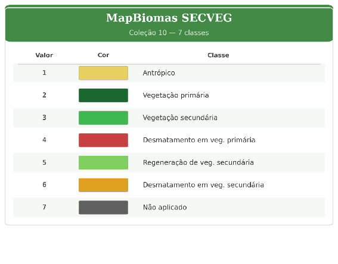

The SECVEG (Secondary Vegetation) product from MapBiomas classifies Brazilian vegetation cover based on the detection of suppression and regeneration events using the Landsat time series (1985–2023).

It contains seven classes, of which two — Primary Vegetation (code 2) and Secondary Vegetation / Regeneration (codes 3 and 5) — were used to define the Primary Forest and Secondary Forest classes, respectively.

#### **Table A2. Restore+ (Version 2)**

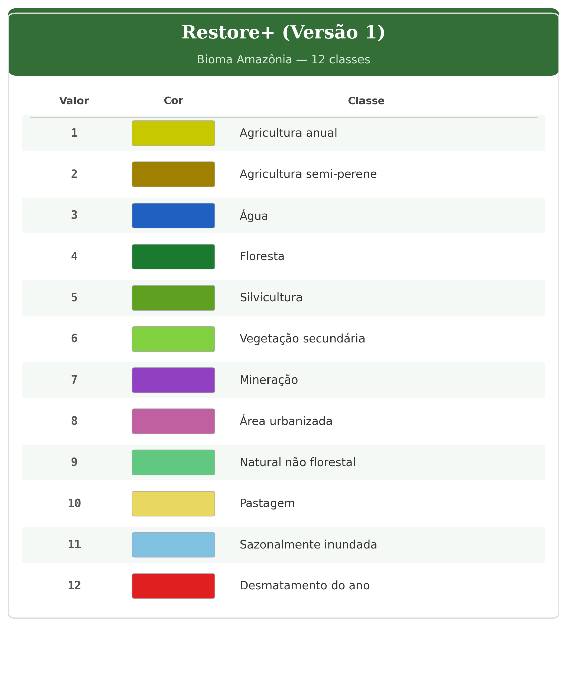

Restore+ (Version 2) is an annual land-use and land-cover dataset specifically developed for the Amazon biome, with a focus on deforestation, restoration, and forest regeneration.

It includes 12 thematic classes, which were used to compute all MAgPIE land-use classes within the Amazon biome in the hybrid configuration. Class 4 (Forest) and class 11 (Seasonally Flooded) were grouped as Primary Forest; class 6 (Secondary Vegetation) corresponds to Secondary Forest; classes 1 and 2 correspond to Agriculture; class 10 to Pasture; class 5 to Forest Plantation; class 8 to Urban Area; and classes 3, 7, 9, and 12 were grouped under Other land uses.

#### **Table A3. MapBiomas (Collection 10, LUC Product)**

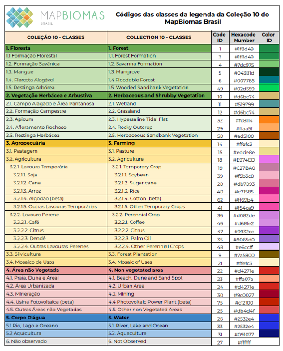

The LUC (Land Use and Cover) product from MapBiomas Collection 10 provides annual land-use and land-cover mapping for the entire Brazilian territory (1985–2023). From the full set of available classes, this analysis used 16 classes corresponding to Agriculture (codes 20, 35, 39, 40, 41, 46, 47, 48, 62), Pasture (15), Forest Plantation (9), and Urban Area (24). The “Other” category in MapBiomas LUC was calculated as a residual, defined as the total cell area minus the sum of all other mapped classes.

## **Appendix B**

#### **Table B1. Crops: Table 1612**

| Crops (PAM) | Translation |
| ----- | ----- |
| Abacaxi | Pineapple |
| Algodão | Cotton |
| Amendoim | Peanut |
| Arroz | Rice |
| Aveia | Oat |
| Batata | Potato |
| Cana de Açúcar | Sugarcane |
| Forragem | Sugarcane for forage |
| Centeio | Rye |
| Cevada | Barley |
| Ervilha | Pea |
| Fava | Broad bean |
| Feijão | Bean |
| Girassol | Sunflower |
| Mandioca | Cassava |
| Melancia | Watermelon |
| Melão | Melon |
| Milho | Maize |
| Soja | Soybean |
| Sorgo | Sorghum |
| Tomate | Tomato |
| Trigo | Wheat |
| Triticale | Triticale |

#### **Table B2. Crops: Table 1613**

| Crops (PAM) | Translation |
| :---- | ----- |
| Abacate | Avocado |
| Algodão arbóreo (em caroço) | Tree cotton (seed cotton) |
| Azeitona | Olive |
| Banana (cacho) | Banana (bunch) |
| Borracha (látex coagulado) | Rubber (coagulated latex) |
| Borracha (látex líquido) | Rubber (liquid latex) |
| Cacau (em amêndoa) | Cocoa (beans) |
| Café (em grão) Total | Coffee (green beans) total |
| Caju | Cashew apple |
| Caqui | Persimmon |
| Castanha de caju | Cashew nut |
| Chá-da-índia (folha verde) | Tea (green leaves) |
| Coco-da-baía | Coconut |
| Dendê (cacho de coco) | Oil palm (fresh fruit bunch) |
| Erva-mate (folha verde) | Yerba mate (green leaves) |
| Figo | Fig |
| Goiaba | Guava |
| Guaraná (semente) | Guaraná (seeds) |
| Laranja | Orange |
| Limão | Lemon |
| Maçã | Apple |
| Mamão | Papaya |
| Manga | Mango |
| Maracujá | Passion fruit |
| Marmelo | Quince |
| Noz (fruto seco) | Nut (dried fruit) |
| Palmito | Heart of palm |
| Pera | Pear |
| Pêssego | Peach |
| Pimenta-do-reino | Black pepper |
| Sisal ou agave (fibra) | Sisal or agave (fiber) |
| Tangerina | Tangerine |
| Tungue (fruto seco) | Tung (dried fruit) |
| Urucum (semente) | Annatto (seeds) |
| Uva | Grape |

#### **Table B3. Crops from MagPie**

| MagPie's Crops | Year: 1995 | Year: 2000 | Year: 2005 | Year: 2010 |
| ----- | ----- | ----- | ----- | ----- |
| **Soybean** | Soybean_1995 | Soybean_2000 | Soybean_2005 | Soybean_2010 |
| **maize** | maize_1995 | maize_2000 | maize_2005 | maize_2010 |
| **cottn_pro** | cottn_pro_1995 | cottn_pro_2000 | cottn_pro_2005 | cottn_pro_2010 |
| **Sugr_cane** | Sugr_cane_1995 | Sugr_cane_2000 | Sugr_cane_2005 | Sugr_cane_2010 |
| **Cassav_sp** | Cassav_sp_1995 | Cassav_sp_2000 | Cassav_sp_2005 | Cassav_sp_2010 |
| **tece** | tece_1995 | tece_2000 | tece_2005 | tece_2010 |
| **trce** | trce_1995 | trce_2000 | trce_2005 | trce_2010 |
| **Rice_pro** | Rice_pro_1995 | Rice_pro_2000 | Rice_pro_2005 | Rice_pro_2010 |
| **Rapeseed** | Rapeseed_1995 | Rapeseed_2000 | Rapeseed_2005 | Rapeseed_2010 |
| **Groundnut** | Groundnut_1995 | Groundnut_2000 | Groundnut_2005 | Groundnut_2010 |
| **Sunflower** | Sunflower_1995 | Sunflower_2000 | Sunflower_2005 | Sunflower_2010 |
| **Potato** | Potato_1995 | Potato_2000 | Potato_2005 | Potato_2010 |
| **Puls_pro** | Puls_pro_1995 | Puls_pro_2000 | Puls_pro_2005 | Puls_pro_2010 |
| **Others** | Others_1995 | Others_2000 | Others_2005 | Others_2010 |
| **Oilpalm** | Oilpalm_1995 | Oilpalm_2000 | Oilpalm_2005 | Oilpalm_2010 |
| **Sugr_beet** | Sugr_beet_1995 | Sugr_beet_2000 | Sugr_beet_2005 | Sugr_beet_2010 |
| **Begr** | Begr_1995 | Begr_2000 | Begr_2005 | Begr_2010 |
| **Betr** | Betr_1995 | Betr_2000 | Betr_2005 | Betr_2010 |
| **Foddr** | Foddr_1995 | Foddr_2000 | Foddr_2005 | Foddr_2010 |

#### **Table B4. PAM to MagPie**

| Class MAgPIE | Culturas PAM (PT-BR) | Translation (EN) |
| :---- | :---- | :---- |
| tece | Trigo, Cevada, Centeio, Aveia, Triticale | Wheat, Barley, Rye, Oat, Triticale |
| trce | Sorgo | Sorghum |
| maize | Milho | Maize |
| Rice_pro | Arroz | Rice |
| Soybean | Soja | Soybean |
| Rapeseed | — | — |
| Groundnut | Amendoim | Peanut |
| Sunflower | Girassol | Sunflower |
| Oilpalm | Dendê (cacho de coco) | Oil palm (fresh fruit bunch) |
| Puls_pro | Feijão, Fava, Ervilha | Bean, Broad bean, Pea |
| Potato | Batata | Potato |
| Cassav_sp | Mandioca | Cassava |
| Sugr_cane | Cana de açúcar | Sugarcane |
| Sugr_beet | — | — |
| Cottn_pro | Algodão, Algodão arbóreo (em caroço) | Cotton, Tree cotton (seed cotton) |
| Others | Abacaxi, Banana, Laranja, Maçã, Uva, Manga, Mamão, Melancia, Melão, Tomate, Café, Cacau, etc. | Pineapple, Banana, Orange, Apple, Grape, Mango, Papaya, Watermelon, Melon, Tomato, Coffee, Cocoa, etc. |
| Begr | — | — |
| Betr | — | — |
| Foddr | Cana de açúcar para forragem | Sugarcane for forage |

“—” = No corresponding crop in PAM.
